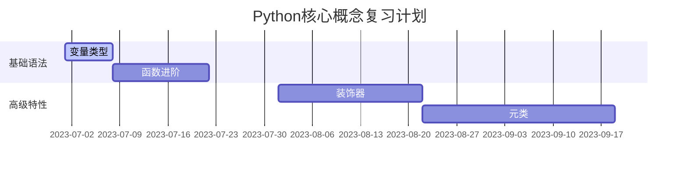

## 一、核心认知框架
### 1. 元能力定位
• **核心命题**：自学是唯一值得终身打磨的元技能（李笑来，2023修订版P12）
• **能力模型**：学→练→用→造四阶递进系统  
  • 学：信息筛选（官方文档 > 教科书 > 技术博客）  
  • 练：TDD测试驱动开发（Python unittest模块实践）  
  • 用：GitHub开源项目贡献（至少3个PR里程碑）  
  • 造：独立作品构建（如PyPI发布个人工具包）

### 2. 认知突破点
• **过早引用陷阱**：  
  *案例*：Python函数未声明前直接调用，通过异常反向学习参数传递机制  
  *对策*：构建"最小可行知识树"（MVKT），允许知识缺口存在（龙渊，2023）

• **困难幻觉破除**：  
  采用"预算思维"：设定3年学习周期（每日2小时=2190小时），容忍前300小时低效期

---

## 二、方法论体系
### 1. 学习工程化
#### 1.1 四遍读书法
| 遍数 | 目标                  | 工具                | 时间占比 |
|------|-----------------------|---------------------|----------|
| 1    | 框架速览              | XMind思维导图       | 15%      |
| 2    | 标注认知冲突点        | MarginNote批注系统  | 30%      |
| 3    | 建立概念网络          | Obsidian双向链接    | 40%      |
| 4    | 跨域知识联结          | Zettelkasten卡片盒  | 15%      |

#### 1.2 刻意练习五维模型
```python
class DeliberatePractice:
    def __init__(self):
        self.target = "30天掌握Pandas核心API"  # 明确目标
        self.method = "Jupyter Notebook测试驱动"  # 科学方法
        self.repetition = 3  # 重复密度系数
        self.feedback = CodeReviewBot()  # 即时反馈
        self.focus = PomodoroTimer(25min)  # 专注阈值
```

### 2. 认知升级工具
#### 2.1 费曼检验法
• **检验标准**：  
  • Level1：向初中生解释递归函数  
  • Level2：用生活案例说明BNF范式  
  *案例*：用俄罗斯套娃模型图解递归调用栈

#### 2.2 格林布拉特迁移三问
1. **现金流检验**：该技能能否创造持续收益？（如自动化脚本节省工时）  
2. **回报率检验**：时间投资能否实现>15%复合增长？（技术栈迭代速度）  
3. **源头检验**：是否直接阅读官方文档？（Python PEP标准优先）

---

## 三、实践操作系统
### 1. 知识管理矩阵
#### 1.1 康奈尔笔记改良版
| 区域  | 内容范例（Python装饰器）     | 工具支持          |
| --- | ------------------- | ------------- |
| 主栏  | @timer实现原理（闭包+函数包装） | Notion数据库模板   |
| 副栏  | FastAPI路由装饰器实战案例    | Excalidraw图示  |
| 总结栏 | 本周装饰器使用频率统计（雷达图）    | Matplotlib可视化 |

#### 1.2 多维卡片盒
| 卡片类型 | 内容实例                          | 标签系统                      |
|----------|-----------------------------------|-----------------------------|
| 白卡     | PEP8代码规范要点                  | #编程规范 #Python            |
| 蓝卡     | Django ORM性能优化技巧            | #Web开发 #数据库            |
| 红卡     | "全局变量滥用"反模式分析           | #认知误区 #代码坏味道        |

### 2. 时间投资策略
#### 2.1 预算管理模型
• **3年学习周期**：  
  • Phase1（0-6月）：语法基础+100小时编码量  
  • Phase2（7-18月）：框架精通+3个完整项目  
  • Phase3（19-36月）：技术领导力+开源影响力

#### 2.2 间隔复习系统


---

## 四、检验与迭代
### 1. 月度审计清单
1. [ ] GitHub提交记录≥50次（Greenwall可视化）  
2. [ ] Stack Overflow技术回答≥3个（声望值增长监测）  
3. [ ] 知识图谱新增节点≥20个（Obsidian Graph分析）  
4. [ ] 跨学科迁移案例完成（如用Pandas分析股票数据）

### 2. 认知升级路径
• **阶段突破标志**：  
  • 青铜：能独立完成教程级项目（Flask博客系统）  
  • 白银：解决GitHub issues列表中的未解问题  
  • 黄金：被官方文档收录贡献者名单（如CPython PR）

---

## 五、工具生态推荐
| 工具类型     | 推荐工具                  | 使用场景                  |
|--------------|---------------------------|---------------------------|
| 知识管理     | Obsidian+Git              | 建立版本化知识库          |
| 代码实践     | Jupyter Lab+VSCode        | 交互式学习+工程开发        |
| 进度监控     | Toggl Track+Notion仪表盘  | 时间投资回报分析          |
| 社区建设     | GitHub Discussions        | 构建个人技术品牌          |

---

**行动指南**：  
1. 立即创建`self-teaching`仓库，实践"学练用造"闭环  
2. 设置每周三20:00-22:00为"费曼输出时间"  
3. 参与3个星标>1k的开源项目（从解决文档错别字开始）

> "所谓手艺，就是把时间淬炼成作品的能力。" —— 李笑来《自学是一门手艺》结语