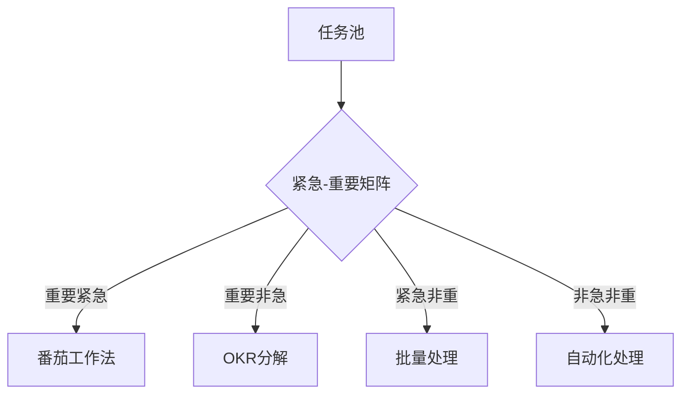

#### 一、阅读框架设计：SQ3R法+主题式拆解
**1. 全局概览（Survey）​**
- ​**核心命题**：时间不可管理，管理自我心智是根本。
- ​**底层逻辑**：
    - 时间焦虑源于心智未开 → 突破认知局限 → 建立积累型思维 → 构建终身学习系统。
- ​**全书结构**：  
    认知觉醒（1-3章）→ 现实法则（4章）→ 行动系统（5-8章）→ 长期主义（终章）。

**2. 深度提问（Question）驱动阅读**
- 为何“时间管理”是伪命题？
- 如何量化“心智成熟度”？
- 现实法则与反人性本能的冲突如何调和？
- 任务分解的最小行动单元是什么？
- 7年周期理论的科学依据？

**3. 本书核心主张**  
   • 时间不可管理，一切依靠积累。  
   • 成功需先开启心智，用正确方法做正确的事。

---

#### 二、核心方法论拆解（康奈尔笔记法）

#####  困境：时间焦虑的根源
1. **问题表现**  
   • 任务堆积、拖延、效率低下，陷入“没时间了”的恐慌。  
   • 错误根源：低估任务耗时、执行中出错、未按时开始。

2. **深层原因**  
   • **欲望与现实的矛盾**：想速成却忽视积累。  
   • **心智未开**：缺乏理性判断能力，盲目追求捷径。

3. **解决方向**  
   • 管理自我而非时间，接受现实，积累成长。

##### 主题1：心智操作系统升级

|关键概念|核心观点|案例/工具|批判性思考|
|---|---|---|---|
|​**元认知能力**|对思考过程的再思考，是突破经验局限的核心|李笑来编程学习中的“递归式学习路径”|需警惕“过度反思陷阱”，平衡实践与反思的时间分配|
|​**心智带宽**|大脑处理信息的容量有限，需通过记录减少认知负荷|事件-时间日志（柳比歇夫统计法）|日志记录可能陷入形式主义，需结合OKR目标管理法形成闭环|
|​**系统1/2思维**|快思考（直觉）与慢思考（理性）的博弈|拒绝盲打时的直觉错误|丹尼尔·卡尼曼理论的本土化应用需考虑文化差异|

**行动指南**：

- 建立「问题树」：用XMind将日常决策场景分类，标注直觉错误高发区。
- 实践「认知审计」：每月复盘重大决策，分析系统1/2思维使用比例。

---

##### 主题2：现实法则的工程化应用

**1. 速成破除公式**  
`任务复杂度(C)= 知识缺口(G) × 经验系数(E)`  
_应用案例_：托福词汇突破

- G=词汇量缺口（5000→8000）
- E=记忆曲线调整系数（艾宾浩斯 vs 李笑来21天法）
- 解：C=3000×1.5=4500有效记忆单位，每日处理150单位需30天。

**2. 交换定律矩阵**

|现有资源类型|可交换维度|转化策略|
|---|---|---|
|时间资源|技能习得|10000小时定律的模块化切割|
|注意力资源|信息筛选能力|建立RSS信息枢纽+反向链接系统|
|社交资本|弱连接的指数增值|邓巴数理论下的精准关系维护|

**批判视角**：
- 资源转化存在边际递减效应，需动态评估交换阈值。
1. **心智定义**  
   • 过往知识与经验的总和，决定思考模式与判断力。
2. **案例启示**  
   • **编程学习的复利效应**：早年积累的知识带来长期职业优势。  
   • **拒绝盲打的教训**：轻视基础技能导致后续效率损失。
3. **关键认知**  
   • **主动学习**：未知技能的价值需实践后显现（如“技不压身”）。  
   • **区分“想要”与“能换”**：用现有资源逐步达成目标。

---

#### 三、行动系统构建（GTD+敏捷开发）
**1. 任务管理四维模型**

**2. 敏捷开发式学习**

- 最小可行性知识单元（MVKU）：如编程中的函数封装
- 持续集成：日清知识卡片（Anki+Obsidian联动）
- 迭代周期：设置7天冲刺（Sprint），每日站立会议式复盘

**实践案例**：

- 写作能力提升路径：
    1. MVKU=500字观点短文
    2. CI=日更公众号+读者反馈分析
    3. Retro=周度结构优化（SCQA模型迭代）

---

#### 四、批判性延伸思考

##### 现实：必须接受的五大法则
1. **速成绝无可能**  
   • 任务复杂度决定耗时，短期无法跨越积累过程。

2. **交换才是硬道理**  
   • 用“我有的”换“我要的”，逐步积累资本。

3. **完美永不存在**  
   • 过度追求完美是脆弱的表现，完成优于完美。

4. **未知永远存在**  
   • 接受不确定性，记录问题并持续探索。

5. **现状无法摆脱**  
   • 现状是过去的结果，专注当下行动才能改变未来。

---

##### 管理：高效行动策略
1. **估算时间**  
   • **侯世达法则**：实际耗时总超预期，预留冗余时间。  
   • 区分任务熟悉度，优先完成陌生任务的学习阶段。

2. **及时行动**  
   • 克服拖延：恐惧源于对错误和评价的过度担忧。  
   • **“现在开始”原则**：避免等待完美时机。

3. **直面困难**  
   • 优先处理任务的核心难点，避免简单重复。

4. **流程优化**  
   • **拆解任务**：将复杂任务分解为可执行的子任务。  
   • **并行处理**：结合机械与思考任务提升效率。

5. **感知时间**  
   • **事件-时间日志**：记录过程而非结果，培养时间敏感度。

---

##### 学习：突破经验局限
1. **效率本质**  
   • 学习是最高回报的投资，拓展认知边界。  
   • 技能习得带来“重生感”，开启新世界。

2. **经验的双刃剑**  
   • **局限案例**：个体经验无法覆盖所有情境（如“小马过河”）。  
   • **突破方法**：保持开放心态，避免“以偏概全”。

3. **自学能力**  
   • **检索、阅读、写作、实践**：四位一体的学习闭环。  
   • **反证与辨析**：质疑权威，独立验证信息。

---

##### 总结：与时间做朋友的路径
1. **积累信念**：微小进步叠加产生质变。  
2. **心智升级**：持续反思、记录、优化操作系统。  
3. **长期主义**：7年周期迭代成长，接受缓慢但坚定的改变。

> “人的理性建立在接受现实的基础上，只有接受现实，才可能开始运用心智作出理性决定。” —— 李笑来

##### 延伸：思考
**1. 理论边界探讨**

- 7年周期论 vs 《刻意练习》的1万小时定律
- 心智带宽假设 vs 《稀缺》中的管窥效应
- 时间日志法 vs 现代时间块管理（Time Blocking）

**2. 文化适配性分析**

- 东方集体主义文化下「比较陷阱」的深化影响
- 应试教育体系对「元认知能力」的压制效应
- 互联网时代「速成思维」的变异形态（知识付费泡沫）

---

#### 五、个人操作系统升级路线图

**阶段1：基础设施搭建（0-6月）​**

- 建立双链笔记系统（Logseq+Readwise）
- 设计时间审计仪表盘（Toggl Track+Google Data Studio）
- 构建心智模型库（思维模板100+）

**阶段2：能力模块化（6-18月）​**

- 开发专业领域知识晶体（如「托福教学决策树」）
- 建立跨学科连接点（认知科学×教育理论×编程思维）
- 实验反脆弱学习策略（主动制造可控挫折）

**阶段3：系统自进化（18月+）​**

- 开发自动化反思代理（Python+GPT API）
- 构建个人指数增长模型（技能组合的复利效应）
- 实施「认知套利」战略（跨领域思维迁移）

---

#### 六、延伸实践工具包

1. ​**时间感知训练**
    
    - 使用Pomodoro++（定制化番茄钟）进行注意力校准
    - 实施「时间定价法」（每小时机会成本计算）
2. ​**心智升级实验室**
    
    - 创建「认知杠铃策略」（90%安全学习+10%高风险探索）
    - 运行「思想棱镜实验」（同一问题用6种思维模型解析）
3. ​**反脆弱实践场**
    
    - 设计「可控崩溃测试」（如主动参加辩论赛）
    - 建立「负反馈增强回路」（错误分析→模式修正→压力测试）

---

