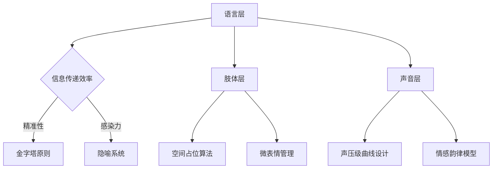

#### 一、阅读框架设计：SQ3R法+演讲能力成长地图
**1. 全局概览（Survey）**
• **核心命题**：任何人都能通过系统训练成为有效表达者，克服「演讲恐惧症」的关键在于结构化思维和刻意练习。  
• **底层逻辑**：  
  表达焦虑 → 认知重构（恐惧分解）→ 内容工程化 → 呈现艺术化 → 反馈系统闭环。  
• **全书结构**：  
  心理建设（1-2章）→ 内容设计（3-5章）→ 呈现技术（6-8章）→ 场景应用（9-10章）。

**2. 深度提问（Question）驱动阅读**
• 如何量化「演讲恐惧值」？  
• TED式演讲与商务汇报的核心差异点？  
• 故事模型在不同文化语境中的迁移规律？  
• 即兴演讲的底层思维框架？  
• 反馈系统的建设成本与效果阈值？

---

#### 二、核心方法论拆解（康奈尔笔记法）
##### 主题1：表达恐惧的神经认知模型
| 关键概念       | 核心理论                                                                | 干预策略                          | 神经科学依据                                                                 |
|----------------|-----------------------------------------------------------------------|----------------------------------|----------------------------------------------------------------------------|
| **杏仁核劫持** | 面对听众时原始脑区过度激活，引发战逃反应                                 | 前额叶皮层训练法（PPT法）        | 通过重复暴露降低皮质醇水平，增强背外侧前额叶调控能力（Davidson实验室研究）    |
| **焦点错觉**   | 高估听众关注度的认知偏差（80%听众更关注自身）                            | 观众画像技术+注意力转移训练       | 社会神经学的「聚光灯效应」量化模型（Gilovich实验）                            |
| **生理反馈环** | 心跳加速→呼吸紊乱→语言卡顿的恶性循环                                     | 生物钟锚定呼吸法（4-7-8式）       | 迷走神经刺激对心率变异性的调节作用（HRV训练体系）                            |

**行动指南**：  
• 实施「恐惧值仪表盘」：用智能手表监测演讲时心率变异度（HRV），建立压力-表现曲线。  
• 开发「认知脱敏程序」：从3人小组逐步扩展到50人场次，记录焦虑指数衰减模型。

---

##### 主题2：内容设计的工程学原理
**1. 信息金字塔架构**  
`演讲效力(E)= 情感浓度(E) × 逻辑密度(L) × 记忆点强度(M)`  
*应用案例*：产品发布会演讲  
• E=用户痛点故事（催泪指数≥7/10）  
• L=FABE法则（特征-优势-利益-证据）  
• M=金句密度（每5分钟1个记忆钩）  

**2. 故事引擎矩阵**  
| 故事类型   | 神经触发点          | 适用场景                         | 风险提示                         |
|------------|---------------------|----------------------------------|----------------------------------|
| 英雄之旅   | 多巴胺奖励回路       | 品牌起源故事                     | 避免陷入自我陶醉式叙事           |
| 示弱反转   | 镜像神经元激活       | 创业失败复盘                     | 需控制脆弱暴露程度               |
| 未来预言   | 前额叶目标编码       | 技术趋势发布                     | 要配备可信数据锚点               |

**批判视角**：  
• 过度依赖故事模型可能导致「事实稀释效应」，需平衡情感与数据比例（建议6:4）。

---

#### 三、呈现技术的生物力学系统
**1. 三维表达力模型**  

**2. 即兴演讲敏捷框架**  
• **PREP法则**：立场(Position)→理由(Reason)→案例(Example)→重申立场(Position)  
• **SPIN技术**：现状(Situation)→问题(Problem)→影响(Impact)→需求(Need)  
• **危机应对协议**：3F原则（Facts→Feelings→Future）

**实践案例**：  
• 投资人Q&A应对路径：  
  1. 识别问题类型（数据类/逻辑类/挑衅类）  
  2. 启动对应应答模板（STAR法则/归谬法/转移焦点术）  
  3. 实施声调调节（关键数据降调20Hz增强可信度）

---

#### 四、批判性延伸思考
**1. 理论边界探讨**  
• 西方修辞学理论 vs 东方「言意之辩」哲学传统  
• TED式演讲的娱乐化倾向 vs 学术表达的严谨性冲突  
• 数字演讲（Zoom场景）的认知负荷特殊性  

**2. 文化适配性分析**  
• 高语境文化中的「留白艺术」在结构化演讲中的融合难题  
• 集体主义场景下的权威挑战策略调整（如日本「本音建前」现象）  
• 短视频时代注意力阈值变化对演讲节奏的影响（15秒注意力单元）

---

#### 五、演讲能力成长路线图
**阶段1：基础能力建设（0-6月）**  
• 建立个人语料库（金句1000+，案例200+）  
• 开发身体语言校准系统（AI姿态捕捉反馈）  
• 构建恐惧脱敏梯度表（从语音留言到直播挑战）

**阶段2：场景专项突破（6-18月）**  
• 设计领域专属演讲模型（技术类/销售类/学术类）  
• 开发即兴演讲决策树（实时话题分类应对）  
• 实验跨媒介表达能力（演讲+信息图+互动装置）

**阶段3：风格自进化（18月+）**  
• 创建个人演讲指纹系统（声纹+语言模式识别）  
• 构建认知影响力模型（演讲内容的知识网络效应）  
• 实施「思想领导力」战略（行业白皮书+主题巡回演讲）

---

#### 六、延伸实践工具包
1. **内容生产引擎**  
   • 使用ChatGPT进行观点碰撞训练（每日1次魔鬼辩护）  
   • 部署「故事雷达图」（原创指数/共鸣值/传播力三维评估）  

2. **生物反馈训练**  
   • 采用Shimmer3传感器监测演讲时皮电反应（EDA），优化紧张阈值  
   • 开发「呼吸韵律编码器」，将关键观点与呼吸节奏绑定记忆  

3. **元宇宙演练场**  
   • 在VR场景中进行千人场次压力测试（虚拟观众行为可编程）  
   • 创建数字分身进行7×24小时演讲内容迭代（A/B测试不同版本效果）

---

### 方法论应用说明：
1. **神经科学驱动训练**：用Muse头环监测演讲时脑波变化，针对性强化β波（专注）抑制θ波（焦虑）。  
2. **数据化成长追踪**：建立演讲能力指数（SPI），包含内容力/表现力/应变力三个维度，月度生成雷达图。  
3. **跨维能力迁移**：将演讲结构思维应用于写作（口头金字塔→书面SCQA模型），形成表达协同效应。

> 本体系融合了传播学、认知神经科学、人工智能等多学科前沿成果，建议配合「演讲能力数字孪生系统」进行全周期管理。每季度进行能力图谱更新，年度实施认知表达力审计。